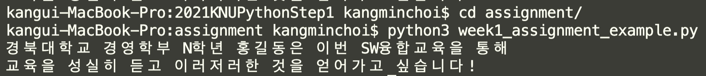

# 첫주차 과제
## 파이썬 코드
`week1_20000000_경영학부_홍길동.py`
```python
# 개인정보 및 목표
name = "홍길동"
major = "경영학부"
grade = "N학년"
goal = "교육을 성실히 듣고 이러저러한 것을 얻어가고 싶습니다"

# 과제 : 아래의 출력 예시에 맞춰 자신의 상황에 맞는 문자열을 출력하시오
# 조건 : 파이썬의 변수, print함수, string-interpolation을 모두 활용

# 출력 예시
"경북대학교 경영학부 N학년 홍길동은 이번 SW융합교육을 통해"
"교육을 성실히 듣고 이러저러한 것을 얻어가고 싶습니다!"
```

## 실행 이미지 예시


# 과제 제출
## 1단계 : 메일 제출
knu.python@gmail.com 로 제출
1. 파이썬 코드
2. 실행 화면 캡처 이미지

## 2단계 : 설문조사 제출
[과제 수합 설문조사](https://forms.gle/wieuZt2uDJ4YXVGj6) 제출
