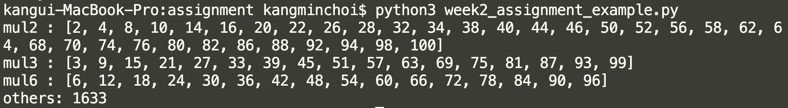

# 2주차 과제
풀이 코드 부분을 작성하여, 실행 이미지 예시와 같은 형태로 출력되도록 하시오

## 제출할 파이썬 코드
`week2_2000000000(학번)_경영학부_홍길동.py`
```python
# 문제 : 해달이는 1부터 100까지의 숫자를 분류하려 한다
# 리스트 "mul2"에는 2의 배수, 리스트 "mul3"에는 3의 배수, 
# 리스트 "mul6"에는 6의 배수를 넣고
# 나머지 수는 모두 더해서 출력하려고 한다. 해달이를 도와주자
# 사용할 개념 : 리스트, for, range, if, %, append, +=

mul2 = []
mul3 = []
mul6 = []
others = 0

# 풀이 코드


# 결과 값
"mul2 = [2, 4, 8, ..., 100]"
"mul3 = [3, 6, 9, ..., 99]"
"mul6 = [6, 12, 18, ..., 96]"
"others = 1633"
```

## 실행 이미지 예시


# 과제 제출
1단계 메일 제출과 2단계 설문조사 제출을 모두 진행하셔야 합니다

## 1단계 : 메일 제출
knu.python@gmail.com 로 제출
1. 파이썬 코드
2. 실행 화면 캡처 이미지

## 2단계 : 설문조사 제출
[과제 수합 설문조사](https://forms.gle/wieuZt2uDJ4YXVGj6) 제출
